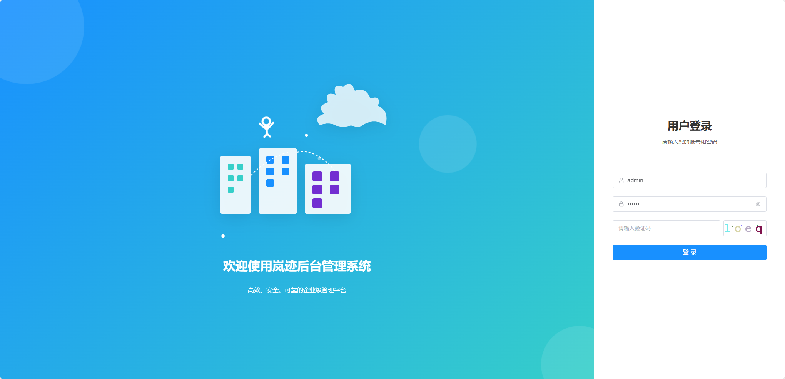
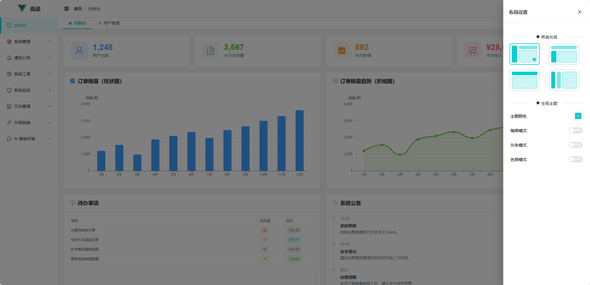
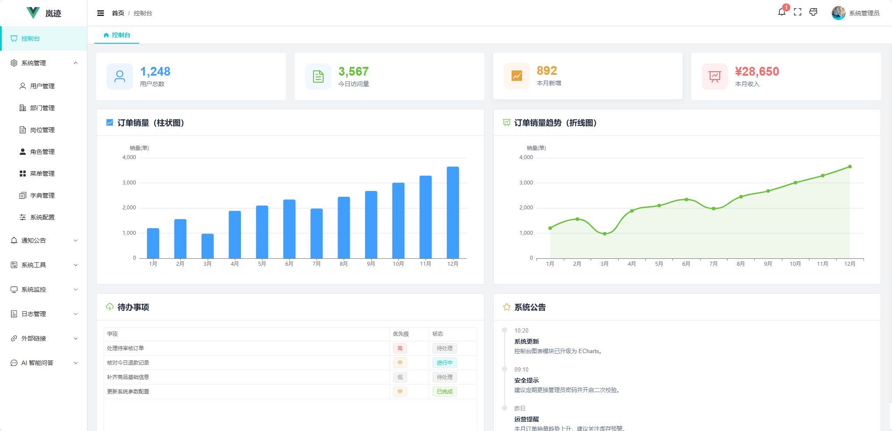
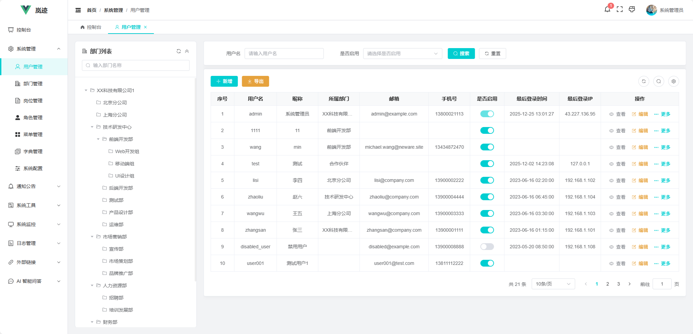
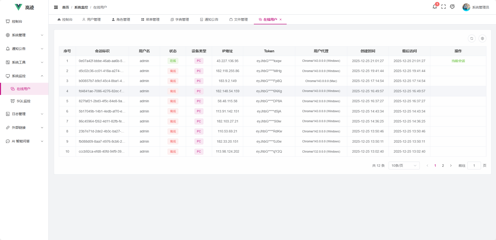
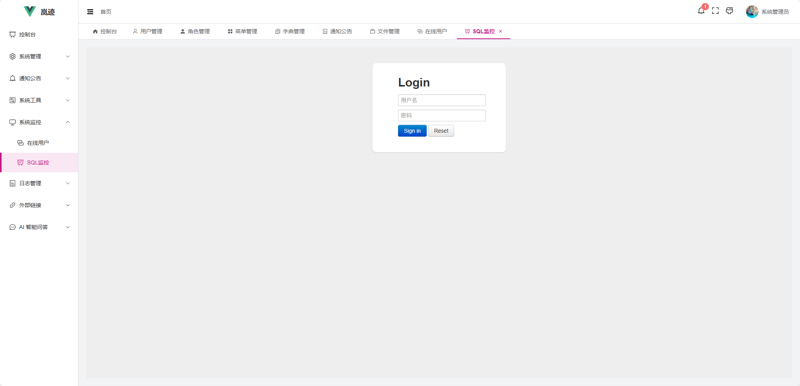

    <h1>Lanjii</h1>
    

        
        
        
        
        
        
        
        
        
    

🚀 **岚迹** 是一个现代化的前后端分离企业级管理系统，采用 Spring Boot + Vue3 技术栈构建，集成完整的RBAC权限系统、AI智能对话和RAG知识库功能，具有无复杂依赖、开箱即用的特点，支持MIT开源协议可商用，可用于构建CRM、OA、博客等各种Web后台系统，适用于企业项目开发或个人学习实践。项目会在有时间时不定期进行更新，如果对你有帮助或感兴趣，欢迎 ⭐ **Star** 持续关注！

##  在线演示

🌐 演示地址：[http://106.54.167.194/admin/login](http://106.54.167.194/admin/login)

🔑 测试账号：admin / 123456

## 短期规划

| 功能              | 描述                                                         | 开发进度 |
| ----------------- | ------------------------------------------------------------ | -------- |
| **RAG 能力增强**  | 对接数据源，支持数据库数据的解析、向量化处理，并能动态维护   | ✅ 已完成 |
|                   | 支持多文档（如PDF、TXT、Markdown、HTML等）的解析、向量化处理 | 🚧 开发中 |
|                   |                                                              |          |
| **AI 大模型集成** | 实现对常见大模型（LLM）的集成，支持多种AI服务商接入          | 📋 待开发 |
|                   | 支持上下文记忆和向量化数据存储（基于内存）                   | ✅已完成  |
|                   |                                                              |          |
| **多租户架构**    | 支持多租户配置和管理，实现用户、数据资源的完全隔离           | 📋 待开发 |

## 项目特色

- 🔐 **RBAC权限控制**：完整的角色权限体系，支持菜单权限、按钮权限、数据权限的细粒度控制，可精确到每个按钮的显示与隐藏
- 🤖 **AI智能集成**：集成大模型和RAG技术，可运用于智能客服、知识库问答、文档助手、代码生成等多种AI应用场景
- 🎨 **界面个性化**：后台管理界面支持4种不同布局模式（经典、顶部菜单、混合、简约），内置多套主题换肤功能
- 👥 **实时用户监控**：支持在线用户实时监控、会话管理、异地登录检测、一键踢出用户等安全管控功能
- 📊 **SQL性能监控**：集成Druid监控，实时展示SQL执行统计、慢查询分析、数据库连接池状态等性能指标
- ✏️ **富文本编辑**：集成wangEditor富文本编辑器，支持图文混排、表格插入、代码高亮等功能，可用于文章、博客发布等内容管理场景

## 功能模块

| 一级菜单 | 二级菜单         | 功能描述                                |
|------|--------------|-------------------------------------|
| 控制台 | -            | 系统首页仪表板，展示系统运行状态、数据统计图表、快捷操作入口等核心信息 |
| 系统管理 | 用户管理         | 用户信息的增删改查、角色分配、岗位分配、用户状态管理、密码重置等功能  |
| | 部门管理         | 部门树形结构维护、多级部门管理、部门信息编辑、部门人员统计等      |
| | 岗位管理         | 岗位信息维护、岗位层级管理、岗位权限配置、岗位人员分配等        |
| | 角色管理         | 角色创建与编辑、权限分配、菜单权限控制、数据权限配置等         |
| | 菜单管理         | 菜单树维护、路由配置、权限标识设置、菜单图标管理等           |
| | 字典管理         | 系统字典类型管理、字典数据维护、下拉选项配置等             |
| | 字典数据         | 具体字典项的增删改查、字典值排序、状态控制等              |
| | 系统配置         | 系统参数配置、全局设置管理、配置缓存刷新等               |
| 通知公告 | 通知公告         | 公告列表查看、公告详情展示、阅读状态跟踪、WebSocket实时推送  |
| | 发布           | 公告内容编辑发布、富文本编辑器                     |
| 系统工具 | 文件管理         | 文件上传下载、文件预览、存储管理、文件分类整理等            |
| 系统监控 | 在线用户         | 实时在线用户监控、会话管理、强制下线、登录地点统计等          |
| | SQL监控        | Druid数据源监控、SQL执行统计、慢查询分析、数据库连接池状态等  |
| 日志管理 | 操作日志         | 用户操作行为记录、操作轨迹追踪、日志检索、异常操作告警等        |
| | 登录日志         | 用户登录记录、登录IP统计、登录失败分析、安全审计等          |
| 外部链接 | Gitee        | 项目源码仓库链接，支持新窗口打开                    |
| | Element Plus | UI组件库官方文档链接                         |
| AI | 客服助手         | AI智能对话、RAG知识库检索、上下文记忆、流式响应等         |
|  | 知识库            | 提供 AI 对话的索增强生成（RAG）                 |

## 演示图

<table>
    <tr>
        <td></td>
        <td></td>
    </tr>
    <tr>
        <td></td>
        <td></td>
    </tr>
    <tr>
        <td></td>
        <td></td>
    </tr>
    <tr>
        <td></td>
        <td></td>
    </tr>
    <tr>
        <td></td>
        <td></td>
    </tr>
    <tr>
        <td></td>
        <td></td>
    </tr>
    <tr>
        <td></td>
        <td></td>
    </tr>
</table>

## 问题反馈

如果您在使用过程中发现任何问题或有新功能建议，欢迎通过以下方式反馈：

- 🐛 **Bug反馈**：发现系统bug或异常行为，请详细描述问题现象和复现步骤
- 💡 **功能建议**：有好的想法或功能需求，欢迎提出您的建议
- 📝 **提交方式**：请在项目仓库中提交Issues，我会在有时间时进行处理

> 💭 **说明**：由于个人精力有限，虽然会认真查看每个Issue，但不保证所有建议都会被采纳。感谢您的理解与支持！

## 版权说明

本项目采用 **MIT开源协议**，这意味着您可以自由地使用、修改、分发本软件，包括用于商业用途。

**使用要求：**
- 在使用本项目时，必须在代码注释、LICENSE文件以及分发的任何副本中完整保留原始版权信息
- 保留原始的MIT许可证声明和版权声明
