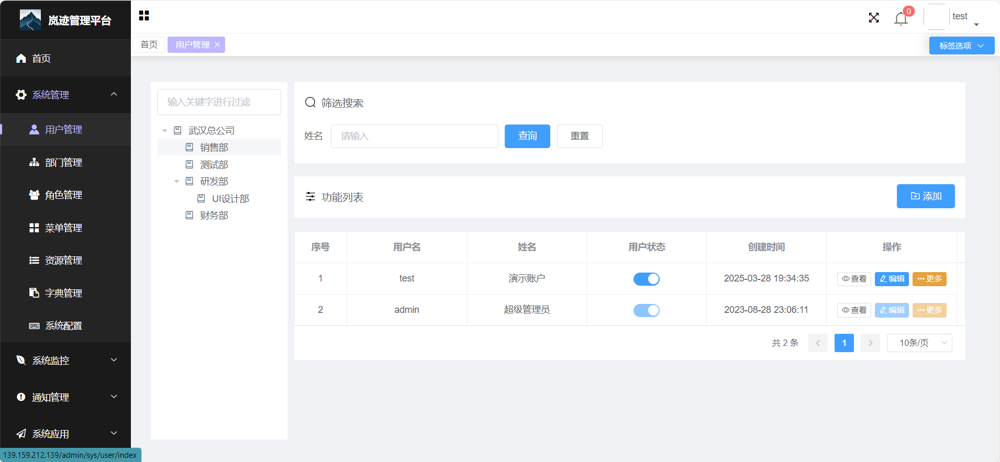
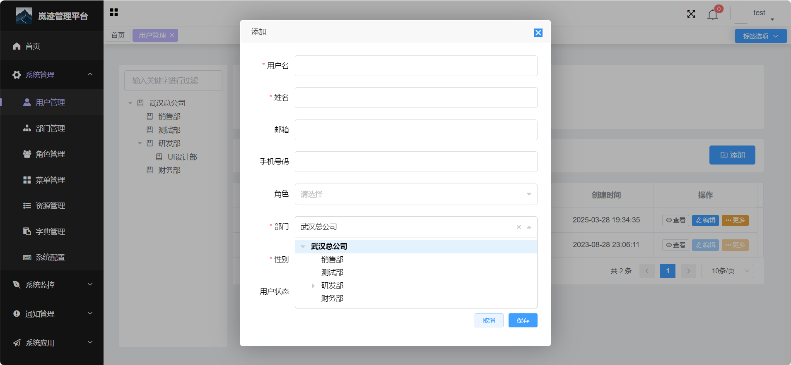
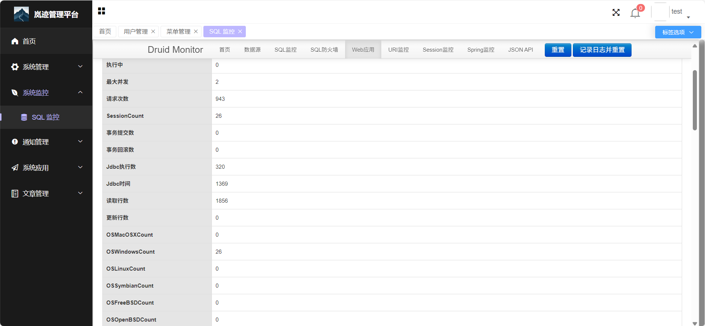

# lanjii-v3

这是一个基于 Spring Boot 的后台管理系统，包含用户管理、角色管理、菜单管理、部门管理、岗位管理、通知公告、系统监控等模块。

##  在线演示

🌐 演示地址：[http://106.54.167.194/admin/login](http://106.54.167.194/admin/login)

🔑 测试账号：admin / 123456

## 功能特性

- 用户管理：支持用户信息维护、角色分配、岗位分配等
- 角色管理：支持角色创建、权限分配、菜单权限控制
- 菜单管理：支持菜单树维护，支持权限控制
- 部门管理：支持部门树维护，支持多级部门管理
- 岗位管理：支持岗位信息维护
- 通知公告：支持通知发布、阅读状态跟踪、WebSocket 实时通知
- 系统监控：支持在线用户管理、操作日志、登录日志
- 文件管理：支持文件上传、下载、管理

## 技术选型

- 后端：Spring Boot、MyBatis Plus、JWT、WebSocket
- 前端：Vue3、Vite、Element Plus、Pinia
- 数据库：MySQL
- 安全：Spring Security、RBAC 权限模型

## 演示图

