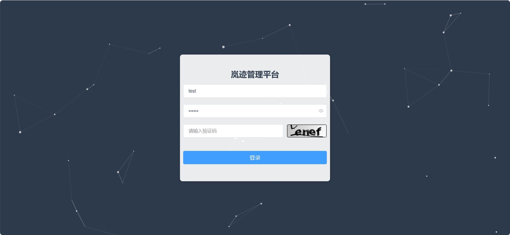
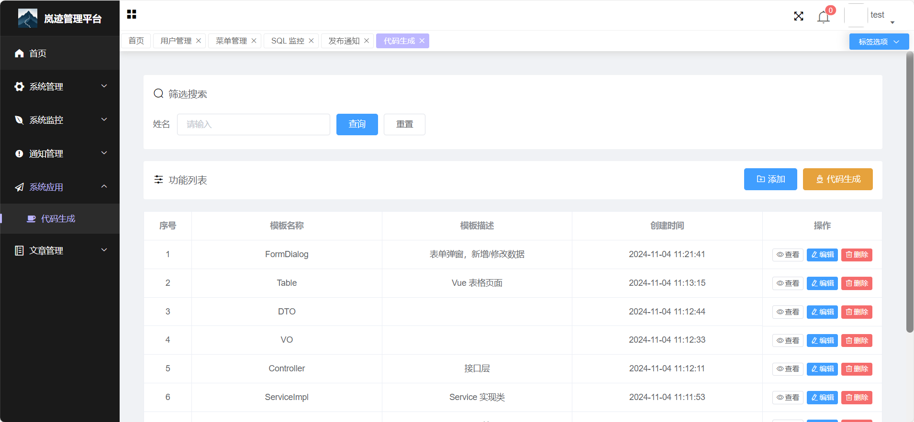
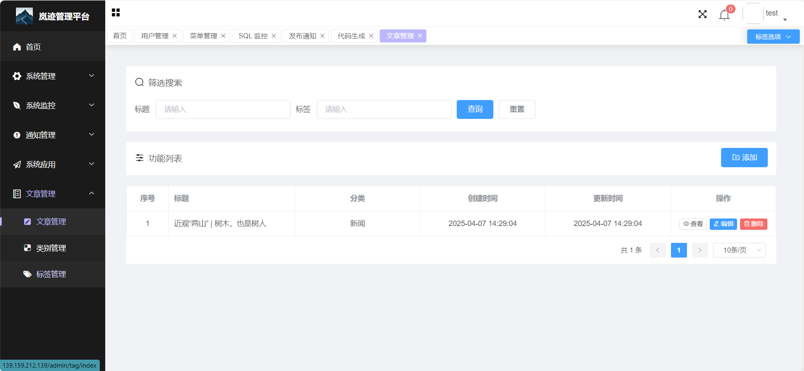

# 岚迹

> 由于这个项目技术老旧，不再进行更新，现已构建了 Vue3 的前端：[Lanjii-vue3](https://gitee.com/leven2018/lanjii-vue-3)。

很早之前就想构建一个自己的后台项目，但是一直是断断续续的写一点。最近有时间，就将之前的代码捡起来，把未完成的工作完成了。细节还没处理，后期有时间再慢点优化，会陆续增加一些新的功能。

## 在线演示

🌐 演示地址： http://139.159.212.139/login

🔑 测试账号：test / 123456 

## 技术架构

### 后端技术
- **核心框架**：Spring Boot 2.x
- **Java版本**：JDK 11
- **安全框架**：Spring Security 5.x 
- **ORM框架**：MyBatis-Plus 3.x 
- **数据库**：MySQL 8.0
- **构建工具**：Maven3.8+

### 前端技术
- **前端框架**：Vue 2
- **Node版本**：Node.js 14+
- **UI组件**：Element UI
- **构建工具**：Webpack

## 系统功能

### 系统管理
- **用户管理**：系统的用户账户管理，支持用户CRUD、状态变更和角色分配  
- **部门管理**：组织架构管理，支持多级树形部门结构  
- **角色管理**：基于RBAC模型的角色定义与权限分配  
- **菜单管理**：动态路由配置，支持多级菜单和资源绑定  
- **资源管理**：API接口权限控制，细粒度管理后端服务端点  
- **字典管理**：系统级键值对字典，支持常量统一管理  
- **系统配置**：应用参数配置，实时生效的基础参数调整  

### 系统监控
- **SQL监控**：集成Druid数据源，提供SQL执行监控与性能分析  
- **在线用户**：系统用户登录状态 

### 通知管理
- **发布通知**：创建系统公告/通知，支持指定接收范围（全部/个人）  
- **我的通知**：用户个人通知中心，支持已读/未读状态管理  

### 系统应用
- **代码生成**：基于Velocity引擎模板的代码生成器，一键生成Controller/Service/Mapper/前端代码  

### 文章管理
- **文章管理**：富文本文章发布与管理，支持Markdown/HTML双模式编辑  
- **类别管理**：文章分类体系 
- **标签管理**：文章标签系统，灵活的内容标记与检索  

## 演示图

## 交流群
> 大家可以进群一起交流，备注“开源”

  

## 捐赠
> 如果能帮助到你，可以请作者喝杯咖啡哦~~~

 
  

